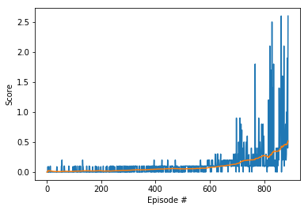

# Continuous Control

## Introduction

This report describes the neural network architecture used to solve the Unity Tennis enironment using a multi-agent DDPG algorithm,
the hyperparammeters used to train the networks and the training results obtained.

## Learning Algorithm

The learning algorithm used to solve the task was a Multi-Agent version of the **** Deep Deterministic Policy Gradient (DDPG) **** algorithm,
which is an actor-critic algorithm.

The current velocity and position of both agents and the ball are used as the input of the actor network, and the output is a vector representing the action (the policy). The critic network estimates the Q-value of the current state and the action output by the actor.

The network weights are updated from the gradients obtained from the temporal difference error signal.
To ensure good exploration DDPG uses a stochastic policy using an Ornstein-Uhlenbeck process for the actor, and a deterministic policy is
used for the critic.

### OU-Noise Decay

A multiplicative decay Factor to decrease the amplitude of the OU-Noise over the time steps was implemeneted. The
effect of this is to make the agent explore less in later time steps as the training score (hopefully!)
increases and gets closer to the target.

## Neural Network Architecture

The DDPG code from my previous project (Continuous Control) was adapted to use two agents which act independently but with a shared experience
buffer. This code is written in Python using PyTorch. Each agent has its own deep neural networks - local and target actor and critic networks. The architecture of the networks is shown below.

### Actor
  
- Hidden Layer 1 : 256 units using relu activation function
- Hidden Layer 2 : 128 units using relu activation function
- Output Layer   : 1 unit using tanh activation function
  
### Critic

- Hidden Layer 1 : 256 units using relu activation function
- Concat Layer   : 256 + size of action space (8)
- Hidden Layer 2 : 128 units using relu activation function
- Output Layer   : 1 unit using tanh activation function
  
## Hyperparameters

After some experimenting, the Hyperparameters were chosen as in the table below:

Parameter            |   Value
---------            |   -----
Replay Buffer Size   |   1e6
Minibatch Size       |   128
Discount Factor      |   0.99  
Tau (soft update)    |   6e-2
Learning Rate Actor  |   1e-3
Learning Rate Critic |   1e-3
L2 Weight Decay      |   0
Initial Epsilon      |   7.0
Minimum Epsilon      |   0.01
Epsilon Decay        |   0.997 (epsilon multiplies by this factor after every learning step)

The Ornstein-Uhlenbeck noise parameters used were left the same as in the DDPG Reacher (project 2) implementation, except for theta
which was set to 0.13.

## Results

The environment was solved (training score greater than or equal to 0.5 for 100 episodes) in 787 episodes.
A graph of the rewards obtained during the training episodes is shown below:

## Ideas For Future Work

For future work the following could be investigated:

- Implement Prioritized Experience Replay from the DQN paper, which may further reduce training time.
- Implement other algorithms like PPO, A3C or D4PG.
- Further experimentation with the DDPG parameters to improve the number of training episodes required before the agents learn to play more
  effectively.
- The performance of the agents is not stable and can collapse if they are allowed to continue learning. Therefore it would be useful to
  investigate how to stabilise the algorithm, perhaps by changing the reinforcement learning rewards and penalties.